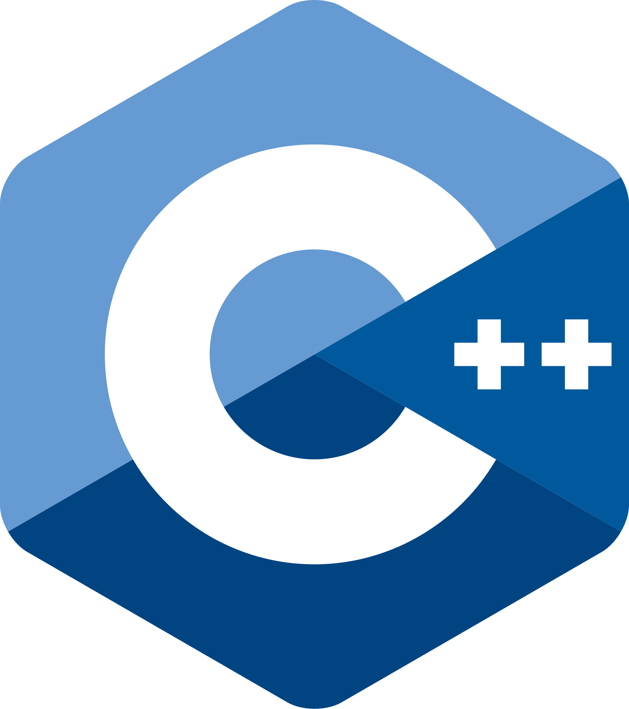
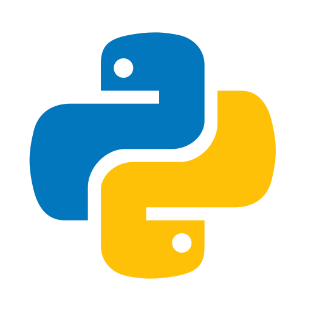
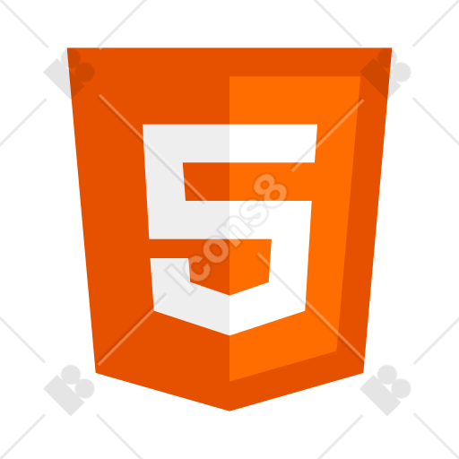
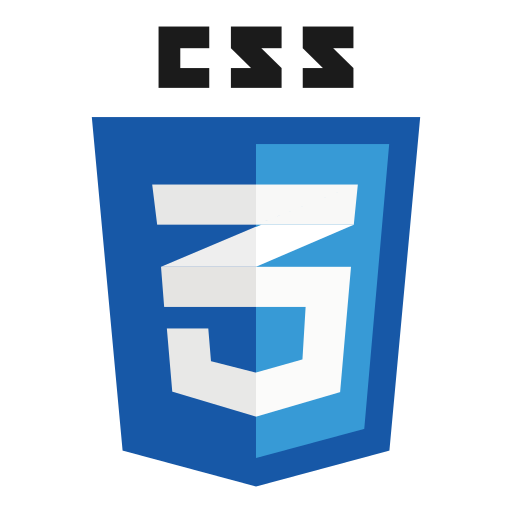

# Hey there 👋, I'm Pallavi Akolkar

## 🎯 My Skills & Technologies
- AI/ML | Deep Learning | Python | LLM 
- Full‑stack (MERN) | HTML | CSS | JS |
- C | Cpp 
- SQL | MongoDB

## 📫 Reach me:
Mail: [pallaviakolkar55@gmail.com](pallaviakolkar55@gmail.com) | [LinkedIn](https://www.linkedin.com/in/pallavi-akolkar/)

##

  

<em>"Passionate about building real‑world solutions 💻✨"</em>

## 🛠️ Skills & Tools

  
  
  
  
  
  
 

